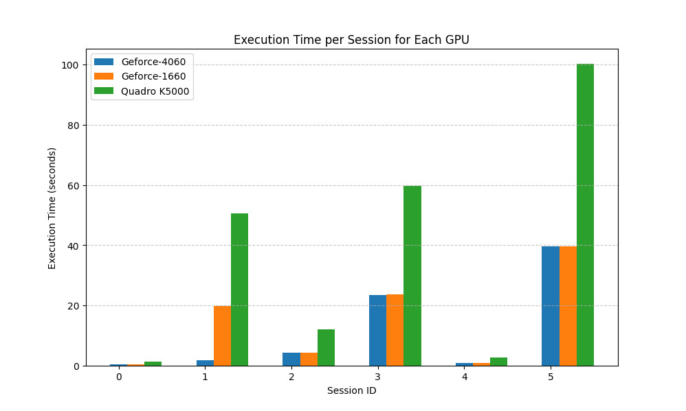
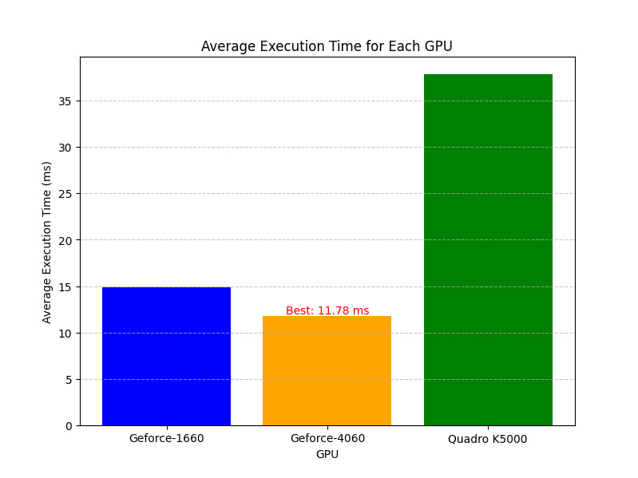
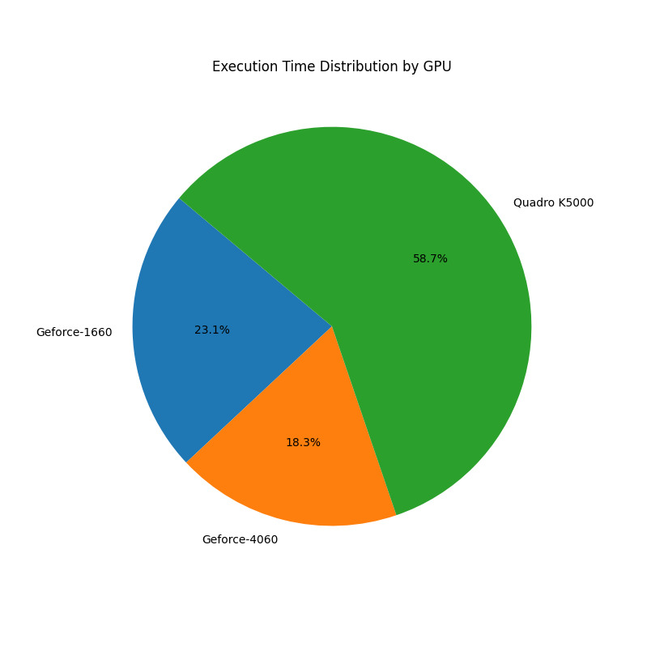

# Insights results

The folder contains all results collected during the tests, in particular contains:

* Tests on different GPUs and their comparison with the sequential version
* Each test session has different inputs such as `input image`, `number of clusters`, `number of iterations`, and so on
* Each test session has its unique ID *(each one executed on three different GPUs)*

The name folder of each session contains the used inputs for that specific test, in particular the name folders follow the pattern: `<ID>-<clusters>C-<iterations>I-<threads>T`.

# How the results are collected

Each session folder has a `README.md` file that contains the main results of the session such as *execution time*, *speedup*, *output image yielded by the program*, and so on.

An advanced insights are contained in the binary files named `report.ncu-rep`, theese files provid detailed information about the execution of the CUDA kernels, in this way we were able to analyze common issues about CUDA kernels, such as bottleneck problem.

The `report.ncu-rep` files were generated using[`NVIDIA Nsight Compute`](https://developer.nvidia.com/nsight-compute), so to read it you have to install this tool, then you have to launch the follow command on your terminal:

```shell
ncu-ui "report.ncu-rep"
```

## More on `nvprof` profiling

For the GPUs that has a compute capability lower than `7.0` we weren't able to use `Nsight Compute`, for this reason we have used `nvprof` tool to collect insights on theese generation of GPUs; `nvprof` profiling are stored in the files called `output.nvprof`.

You can visualize the results yielded by `nvprof` using [`NVIDIA Visual Profiler`](https://developer.nvidia.com/nvidia-visual-profiler).

Anyway you can consult `profiler.output.txt` for summary insights.

# GPUs comparison

The used GPUs for our session tests are:

* `NVIDIA Quadro K5000`
* `NVIDIA GeForce 1660`
* `NVIDIA GeForce RTX 4060`

 
 
